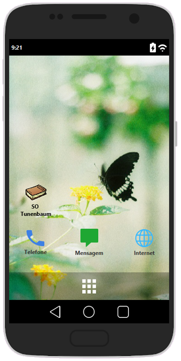

# Trabalho 01 de Sistemas Operacionais

Utilizar as bibliotecas (AWT, Swing ou JavaFX) nativas do Java para criar uma interface gráfica que simule o funcionamento de um sistema operacional.

## Compilação e Execução
    javac Principal.java
    java Principal
## O Software

O trabalho utiliza o Java 8 e JavaFX para simular o SO de um SmartPhone.

